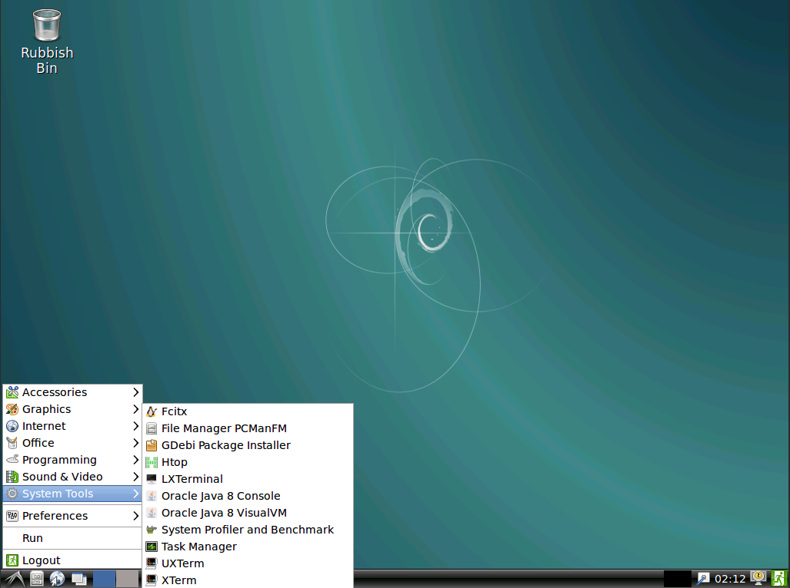
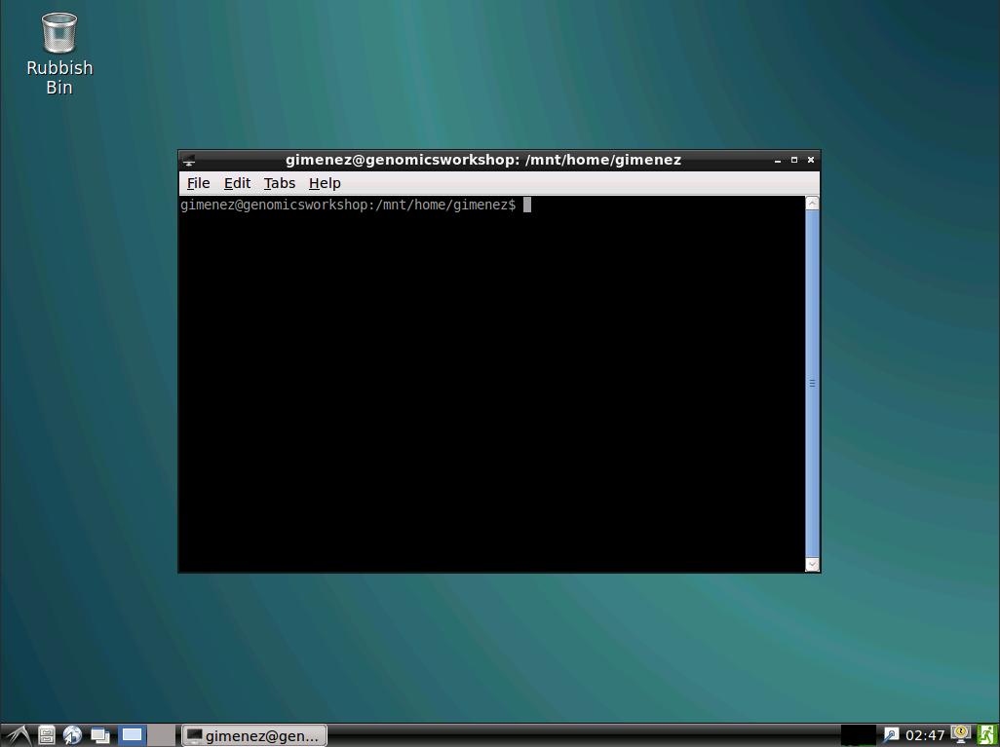

# Genomics Virtual Lab

During the workshop, you will be using Genomics Virtual Lab.
GVL is a cloud based suite for genomics analysis tools.

It is being provided through the Centre for eResearch at the University of Auckland.

if you are interested in learning more please contact directly: nectarinfo@auckland.ac.nz

To access GVL, you will need to open a browser and go to:


[GVL](http://genomicsworkshop.nectar.auckland.ac.nz/vnc/) If the link did not work: http://genomicsworkshop.nectar.auckland.ac.nz/vnc/

## using a linux environment:

Once you are log in, you will be facing a linux machine. Now don\'t escape :)'

Open a terminal (Also know as shell). To do so, click on start (down left corner), then System tools then LXTerminal.




You will see a terminal will open.



### using the terminal

For this workshop you will need to know few shell commands. 
Recommended: shell tutorial from Software Carpentry: [here](https://swcarpentry.github.io/shell-novice/)
To interact with a shell you will need to __write command__ and press enter.

Here is a list of the shell command that we will use:

  * Need to know where you are: 

```
# print working directory
pwd
/mnt/home/gimenez
```
My home directory is located under /mnt/home/gimenez

  * Change directory

```
cd where_you_want_to_go # going in where_you_want_to_go

cd ../ # going upstair

```

  * list what is in a directory:

```
ls
```

  * creating a directory

```
mkdir directoryName
```

### Where are the workshop data stored?

The workshop data are stored there: /mnt/RNAseq_Workshop_Data/

```
ls /mnt/RNAseq_Workshop_Data/
genome  QC  sequencing
```

  * sequencing data:

```
ls /mnt/RNAseq_Workshop_Data/sequencing/
KO1_R1.fastq.gz  KO2_R1.fastq.gz  KO3_R1.fastq.gz  WT1_R1.fastq.gz  WT2_R1.fastq.gz  WT3_R1.fastq.gz
KO1_R2.fastq.gz  KO2_R2.fastq.gz  KO3_R2.fastq.gz  WT1_R2.fastq.gz  WT2_R2.fastq.gz  WT3_R2.fastq.gz
```

## Starting the analysis

To avoid to have files spread all over our computer, we will create a directory in our home to directory.

```
pwd
/mnt/home//gimenez
# home sweet home
mkdir analysis
cd analysis
pwd
/mnt/home//gimenez/analysis
# I am ready to work now!
```
